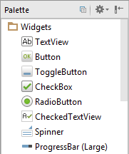
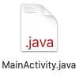
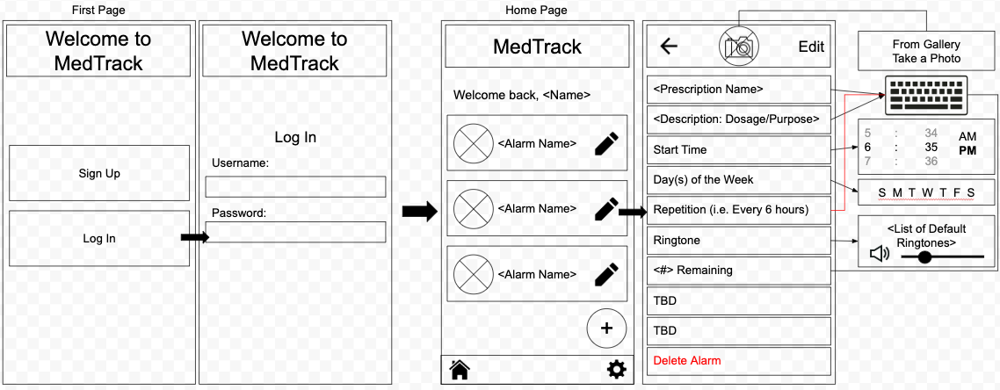

# Entry 3
##### 1/4/20

For the last couple of weeks, my partners and I have been brainstorming ways to overcome our biggest obstacle: collaborating on the project outside of the classroom. Fortunately, we've checked out a laptop from the school that we plan on utilizing for the rest of the school year. Having this laptop will be beneficial to us as we can download and access our tools like Android Studio locally.

Aaliyah Sealey has been researching code to connect Firebase, the Java project from Android Studio, and Github together. Prior to receiving the laptop, Nadia Ousman and I continued learning from more online tutorials. [One](https://www.youtube.com/watch?v=FRIQ6XyZQ4U) of them showed the audience how to make a simple app with `<EditText>` to input a `String` and click a `<Button>` to display the `String` with `<TextView>`. [Another](https://www.youtube.com/watch?v=dFlPARW5IX8) informative tutorial taught Nadia and I a lot of useful tips to navigate ourselves through the Android Studio IDE. I'll remember that:
* Programmers will mostly be using **MainActivity.java** to dictate how the elements on their app will function and **Palette** to place those elements on the layout or blueprint of the app. 

* When coding, it is important to import files in order for your app to run properly. By default, Android Studio may not automatically import relevant files, so it's important to go into **Preferences >> Editor >> Auto Import** to check off all the boxes. The shortcuts to import while typing code are `Option+Enter` on a Mac and `Alt+Enter` on a PC.
* Elements from the Palette can be aligned with their anchors, which contrain them to the top/bottom/left/right sides of the screen along with their buffers, in pixels, found in **Properties**.

We were on our way to complete connecting Android Studio with GitHub in order for all of us to be collaborators on the same repository. Unfortunately, we faced a number of difficult challenges such as understanding what a **Client ID** and a **Client Secret** was. Aaliyah and Nadia were the ones who suggested we take a step back and focus on our Minimum Viable Product (MVP) first. Our plan has changed to first planning and creating an app that works on one phone without the use of Firebase. Once that is done, we will work on adding more to the prototype like having the user sign-in, considering their time-zone, etc. Nadia and I will keep Aaliyah informed on what we've been learning about Java and Android Studio so that she can help us plan with this programming language while keeping Firebase back-burnered.

My partners and I are currently **brainstorming and planning possible solutions** to remind users of their prescriptions as far as the engineering design process goes. Because it is still not practical to be creating code, my partners and I have decided to start building up some pseudocode based on what we imagine our app's user interface, interactions, and functionality to be in layman's terms. We're also planning what our app may look like by creating some preliminary sketches for our wireframe. Nadia and I have translated the pseudocode we have so far into the app's look. This is what we've come up with: 
 
Of course, more sketches will be added and refined as a part of our design planning.

In our software class, we've been learning about `Objects`, `Classes`, and `Instances` from lessons and assignments on [Edhesive](https://edhesive.com/). `Objects` help organize and manipulate data that programmers associate with an action the user may repeat. We might create a `class` called "Alarm" because the user will most likely add `objects`, or new instances, of an alarm with different variable values, or attributes, (like the alarm's prescription name) returned to the user's screen. Overloading `methods` based on the parameters, or data, the user gives will definitely be included in `class Alarm`. Gaining this knowledge is helpful for the programmer because it is reusable and easily organized into a file of its own.

All that being said, I would say that I've definitely improved my skills in **organization** and **creativity** since the last blog entry. With our planning requiring multiple documents like the wireframe, pseudocode, and weekly reports, I've decided to organize them into a folder on [Google Drive](https://drive.google.com/drive/). The pseudocode that I've started is numbered based on what actions will be performed from the beginning (when the app is opened) to when the user creates/edits their alarms. Imagining how our app would work and look like allowed me to be very creative for the design and possible Java coding functions. I will continue to improve upon these skills so that we can plan more efficiently.

[Previous](entry02.md) | [Next](entry04.md)

[Home](../README.md)