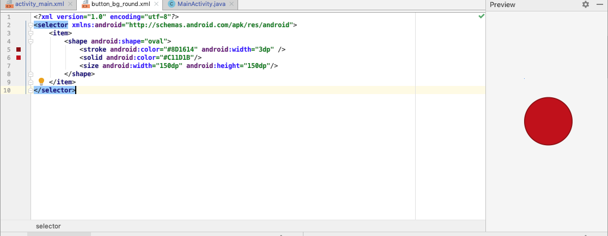
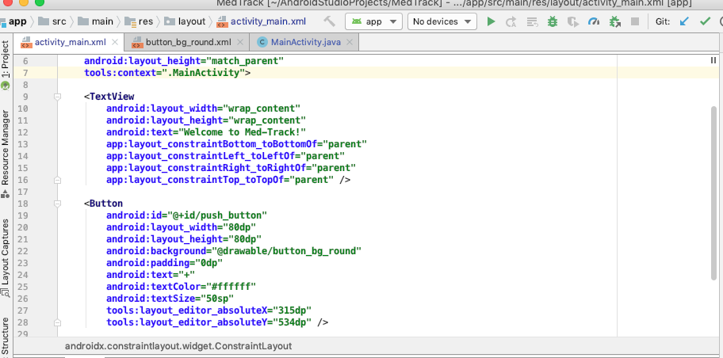
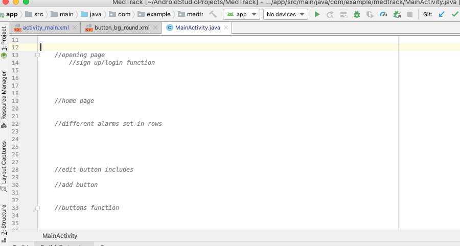

# Entry 4
##### 2/9/20

In my last blog entry, I explained how one of our obstacles had been sending our project from Android Studio to Github in order to begin collaborating from our own devices. A few weeks ago, Aaliyah Sealey managed to use the terminal in Android Studio and successfully connect the local project to the remote repository we had created on GitHub with her account. It was a great milestone for us. We were now able to code into the project from our own IDEs on [CS50](https://ide.cs50.io/).

We are now at the **plan the most promising solution** and **create a prototype** stages of the engineering design process.<br>
Nadia Ousman suggested we start with the button that we had on our app's wireframe for the home page. This button is essential to our app because we want it to add a new alarm when the user presses it. With the information provided on [this](https://developer.android.com/guide/topics/ui/controls/button#java) website from Android's Developer website about buttons, Nadia was able to create a button. However, the button was rectangular, so she found Java code that would make it appear circular. In order to do so, she had to navigate herself to the `drawable/` folder to create a new file called `button_bg_round.xml`. In the file, the following was added:



The code from the Android Developer had many attributes that could be modified like its width, height, text, color, etc. Therefore, we all tinkered with the button's properties and ended up with a red, plus button.



Meanwhile, Aaliyah had been referring back to our pseudocode and sketches in our *MedTrack* folder on [Google Drive](https://www.google.com/drive/). She added comments to the `MainActivity.java` file to remind us of what tasks we need to accomplish to make our app function.



A month ago, I discussed how the lessons and assignments about `Objects` on [Edhesive](https://edhesive.com/courses/apcs_java) would aid us in creating alarms for the user. I chose to create runner code and a class called Alarm that would create a new object, or Alarm, everytime I called one in the runner code.

Runner Code:
```java
import java.io.IOException;

public class runner {

    public static void main(String str[]) throws IOException {
        Alarm alarm1 = new Alarm(8, 10);
        System.out.println("Alarm 1: " + alarm1);

        Alarm alarm2 = new Alarm();
        System.out.println("Alarm 2: " + alarm2);

        Alarm alarm3 = new Alarm(23, 5);
        System.out.println("Alarm 3: " + alarm3);

        Alarm alarm4 = new Alarm(100,100);
        System.out.println("Alarm 4: " + alarm4);

    }
}
```

Alarm Class:
```java
public class Alarm {

    //variables
    private int hour;
    private int minute;
    private String ap;
    private String zero = "";

    //Default constructor
    public Alarm() {
        hour = 7;
        minute = 0;
    }

    //Constructor
    public Alarm(int h, int m) {
        if (h>=1 && h<=24 && m>=0 && m<=59) {
            hour = h;
            minute = m;
        }
    }

    //toString
    public String toString() {
        if ((hour>=1 && hour<=11) || hour ==24) {
            ap = "AM";
        } else {
            ap = "PM";
        }
        if (hour>12) {
            hour -= 12;
        }
        if (minute<10) {
            zero = "0";
        }
        if (!(hour>=1 && hour<=24 && minute>=0 && minute<=59)) {
            return "Invalid time";
        }
        return hour + ":" + zero + minute + " " + ap;
    }
}
```

Output:
```java
~/java/java-apcsa/tests/ $ jcar runner
Alarm 1: 8:10 AM
Alarm 2: 7:00 AM
Alarm 3: 11:05 PM
Alarm 4: Invalid time
```
The code I've written is admittedly nowhere near extraordinary, but it provided me with a guideline on how we would code our alarm(s). Looking back at my code, I can see that there probably won't be a user entering an hour greater than 12 because the AM/PM options will be available for them. Of course, an alarm has more aspects to it as well like having the device sound when it's time to notify the user which will be considered in the following weeks.

My concern is that the Java code we're learning in class on Edhesive isn't exactly the same code we will be including in Android Studio. Both certainly show the same general elements like public classes, extending classes, return types, and so on. Nonetheless, Android Studio has pieces of code that are foreign to my partners and I which will push us to explore and learn new corners of Java. For example, while I was researching how to make our button work as we had desired, I came across [this](https://www.youtube.com/watch?v=W07OAiJCHa0) video which teaches the viewers how the programmer can set an alarm (quite different from how a user would be able to do so) on Android Studio. On the `MainActivity.java` file, the programmer uses the following code:
```java
in MainActivity.java
Button button = (Button) findViewById(R.id.button);
button.setOnClickListener(new_View.OnClickListener() {
  @Override
  public void onClick(View v) {
      Intent intent = new Intent(AlarmClock.ACTION_SET_ALARM);
      intent.putExtra(AlarmClock.EXTRA_HOUR, 10); // 24-hours
      intent.putExtra(AlarmClock.EXTRA_MINUTES, 20);
      startActivity(intent);
  }
});
```
and on the `AndroidManifest.xml` file, the programmer uses:<br>
`<uses-permission android:name="com.android.alarm.permission.SET_ALARM"/>`

Comparing the code I wrote and the code the programmer wrote, there are clear differences. I improved on my **How to read** skills because from this code, I understand that the programmer was creating an event listener and event handler. The event listener was the button named "SET ALARM" waiting to be clicked on. The event handler is the code in the onClick method which sets the hour (on a 24-hour schedule, not 12-hour one) and the minutes of the alarm. In this way, I'm familiarizing myself with the code that is utilized in Android Studio. Additionally, all of us are working on our **Collaboration** skills because we are sticking to completing our Minimum Viable Product and focused on different aspects of our project that are vital in uniting everything together (Nadia with the button, Aaliyah with organization & GitHub connection, and I with the alarms).

Our next steps include:
* Further progress with creating a prototype - for me, it's to find that "bridge" between what I'm learning about Java in class and what I'm learning from Android Studio
* Fix an error that has prevented the Android Studio terminal from committing/pushing/pulling edits to the project
* Try to apply what we will learn from the Deloitte workshop on 2/10/2020 about Business Chemistry & identifying what type of workers we are into our group's development

[Previous](entry03.md) | [Next](entry05.md)

[Home](../README.md)