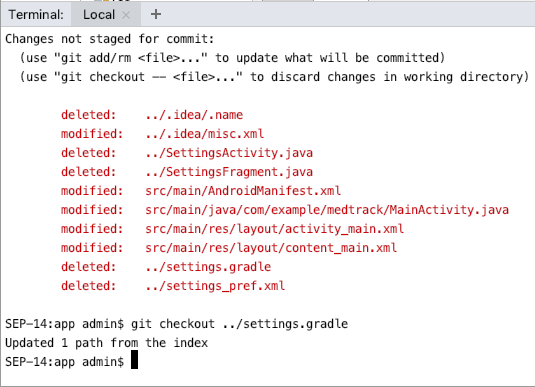
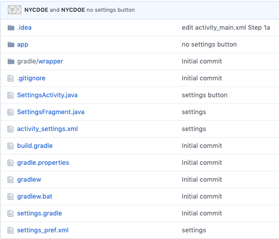
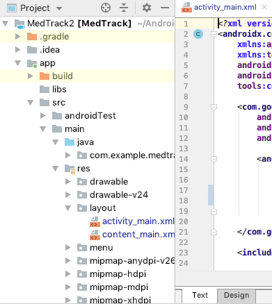

# Entry 5
##### 3/15/20

During the second week of February, Aaliyah Sealey, Nadia Ousman, and I were set on resolving the GitHub issue we were having that prevented the Android Studio terminal from pushing into the remote repository. We ended up having to change our project template from "Empty Activity" to "Basic Activity". The new app template had a Floating Action Button (FAB) which on the preview appeared as a plus button. As defined by Android's Developer [website](https://developer.android.com/guide/topics/ui/floating-action-button), an FAB "is a circular button that triggers the primary action in your app's UI."

We are continuing to **create a prototype** as far as the engineering design process goes. On a weekend, Aaliyah and I were tinkering with the project by seeing how the user could change their interactions with the app through the Settings (i.e. text size). We were following a tutorial and manipulating the code where we saw fit. We were both making commits on different files (she on SettingsActivity.java and I on activity_main.xml) until I received the following message:
```
# Please enter a commit message to explain why this merge is necessary,
# especially if it merges an updated upstream into a topic branch.
#
# Lines starting with '#' will be ignored, and an empty message aborts
# the commit.
```
We thought the reason behind this was because her account was also on the Android Studio project, but then we questioned whether it could have been a merge conflict. I practiced my **How to Google** skills and googled what this message meant. Stack Overflow turned out to be a life saver. The thread that was the most useful was this [one](https://stackoverflow.com/questions/19085807/please-enter-a-commit-message-to-explain-why-this-merge-is-necessary-especially) which said:

**It's not a Git error message, it's the editor as git uses your default editor.
To solve this:**
1. press "i"
2. write your merge message
3. press "esc"
4. write ":wq"
5. then press enter

And voila! The blinking cursor returned. After pushing these edits, nothing appeared to be out of the ordinary. However, the next day, the toolbar and FAB had mysteriously disappeared. According to the terminal in the IDE, where we use git commands, there were no edits made or to be pulled.

Later on, Nadia tried to make edits, but the terminal on [cs50](ide.cs50.io) said she did not have permission to push commits. Eventually, she was reinvited by Aaliyah and the problem was solved. Nadia remade the button to replace the missing FAB.

The entire class was assigned to submit a timeline of our Minimum Viable Product (MVP). On one of our Freedom Fridays, Mr. Mueller brought to our attention that we had incredible ideas for our projects but we were forgetting about the most essential component of the MVP: it has to be *viable*. If our projects can't even function, then there's no way we can expect others to use them. The three of us looked back at our timeline and what we had bulleted as being "necessary" in our application. There was a lot. So we performed some **problem decomposition** while trying to answer the question Mr. Mueller had asked: *If **this** is not there, will the project still work?* We cut a lot of aspects we deemed unnecessary for an MVP. Our MVP needed an alarm to be created with a time of day & name that could be edited by the user. Of course, the alarm has to go off to notify the user that it's time to take their prescriptions. Things like the settings and button could wait for time dedicated beyond the MVP. Admittedly, it was difficult for us to put aside ideas that had bloomed from our creativity and accept that our project may not be as impressive as we had imagined. Nonetheless, it had to be done for the sake of getting a working product.

On another Freedom Friday, we were excited to add code for our MVP. Nadia opened the IDE and wanted to view the layout we had so far. Upon clicking on the Design tab of one of the XML files, the following message appeared: **Design editor is unavailable until after a successful project sync.** Multiple Stack Overflow threads were read to figure out what the problem could be and how to solve it.
* The [first](https://stackoverflow.com/questions/47289011/how-can-i-fix-design-editor-is-unavailable-until-a-successful-build-error) one tried explaining what it was
* The [second](https://stackoverflow.com/questions/2946528/xml-content-is-not-allowed-in-trailing-section/2946593) one explained one of the errors that was popping up on the Build tab of the IDE
* And the [third](https://stackoverflow.com/questions/55778217/toolscontext-mainactivity-is-failing-how-can-i-solve-it) one was used to explain why `tools:context=".MainActivity"` had an error pop up next to it in the files' code

By the end of class, we were not able to have the design tab up and running. A lot of errors were found in the files Aaliyah and I had tinkered with and created for the Settings aspect of the app. Because we had agreed earlier on that it wouldn't be necessary for our MVP, we decided it be best to delete the code we had made in the hopes that the error lied somewhere within that code. Nadia managed to delete some from `activity_main.xml` and `MainActivity.java`, but the error persisted. It was up to me now. At home, I deleted the files and code that I recalled having to do with the Settings function. I found myself having to go through the entire file system on Android Studio and going back and forth to the GitHub remote repository or the files' local history on the IDE for the original starter code. Thinking back, it was probably very inefficient of me to do so (certainly tedious). I guess it was the Guardian in me that made me think "it's all in the details" (reference to the Deloitte Business Chemistry workshop we had).

I used the `git status` command very often to see if I should undo my deletions/modifications.



I referred to the commit messages as well to see what files I should focus on specifically.



At some point, the layout error message had disappeared, but the Design and Text tabs on the XML files had disappeared with it. In other words, there was no way the app's layout could be previewed anymore. I was reasonably concerned. Additionally, the XML files `activity_main.xml`, `content_main.xml`, and `AndroidManifest.xml` were the only files that had multiple errors that had not been there before. I double checked the commits from my GitHub account and realized that I accidentally deleted a file named `settings.gradle` which was never touched since the creation of the project. I mistook it for a file we made for the Settings function because it had the word "settings" in it. On the terminal, I undid the deletion by typing `git checkout settings.gradle` and at long last, the layout was running & the project was successfully synced.



What an adventure! A quick shout out should be given to the creators behind the git commands for predicting the very issues I experienced.

Clearly, this past month has been full of challenges and they've finally all been resolved. I can confidently say that I am 90% familiar with the IDE which I didn't believe I would say so soon and it's all because of the errors we've encountered. We will continue working on the MVP to make a viable application that our users can at least use to remind them to take their medications. Unfortunately, with the news of COVID-19 and public schools being closed until April 20, it might be a lot more difficult to meet up and work on the project. Communication will be key, but I'm optimistic everything will turn out great!

[Previous](entry04.md) | [Next](entry06.md)

[Home](../README.md)